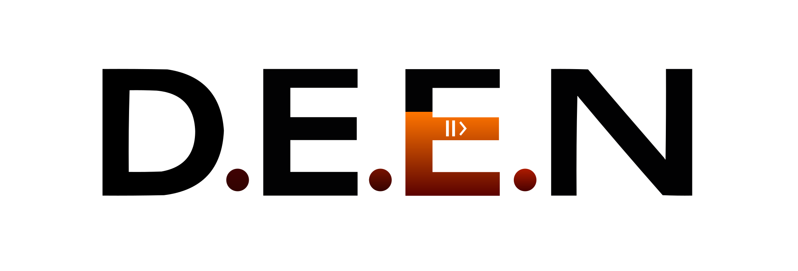

# D.E.E.N – Digital Agency

Веб-сайт диджитал агентства полного цикла, специализирующегося на разработке, дизайне, автоматизации, маркетинге и SMM.

## Технологии

- HTML5
- CSS3 (SCSS)
- JavaScript (jQuery)
- Font Awesome
- Google Fonts

## Структура проекта

```
├── css/
│   ├── styles.css
│   └── styles.scss
├── js/
│   ├── jquery-3.7.1.min.js
│   └── main.js
├── src/
│   └── img/
│       ├── command/
│       └── portfolio/
└── index.html
```

## Функциональность

- Адаптивный дизайн
- Анимации при скролле
- Счетчики статистики
- Форма обратной связи
- Мобильное меню
- Плавный скролл
- Параллакс эффекты
- Валидация форм

## Установка и запуск

1. Клонируйте репозиторий:
```bash
git clone https://github.com/your-username/deen-agency.git
```

2. Откройте `index.html` в браузере или используйте локальный сервер.

## Разработка

Для работы с SCSS:
1. Установите зависимости:
```bash
npm install
```

2. Запустите компиляцию SCSS:
```bash
npm run sass:watch
```

## Лицензия

<p>&copy; 2025 . Все права защищены.</p>
